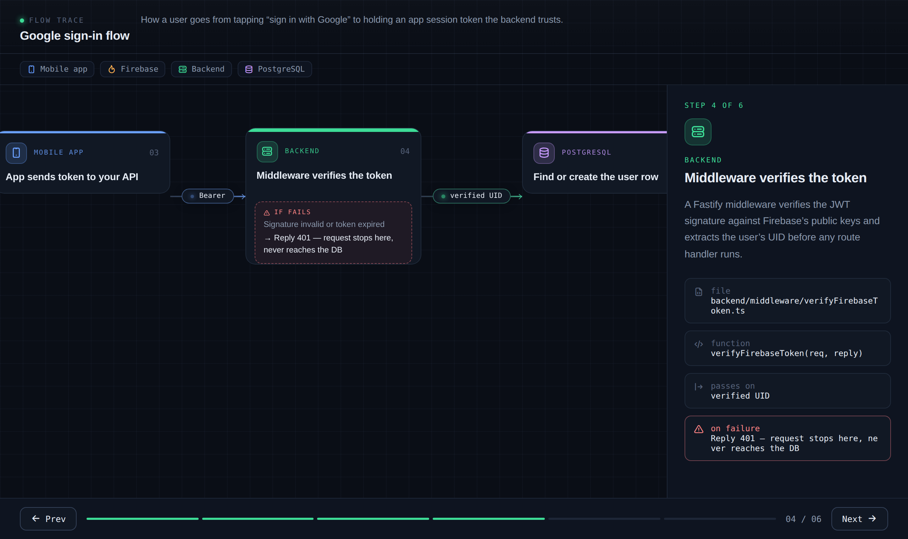

# learn-visualise

An agentic skill that traces a code flow across your repos and renders it as an interactive scrollable diagram so you can *see* how a feature works instead of reading through five files to reconstruct it in your head.

Ask it something like:

```
/learn-visualise help me learn the auth flow
```

…and it reads your actual code, follows the call chain across frontend → backend → database → services, and produces a self-contained HTML diagram: one node per step, colour-coded by which system it happens in, with an explanation panel that travels alongside the data.



## Why

Toggling between folders and projects is such a headache for me and I've always been a visual learner. In addition, in this agentic-AI-write-code era, we stop reading most of our code. This skill helps me make a decision on whether the flow created is already correct or not, and shortens my time understanding an existing feature. This turns the question "how does this work" into a diagram, grounded in the real files (it cites the file and function for every step, so you can jump straight to the source).

## What you get

- **Step-by-step nodes** along a horizontal track you scroll through.
- **Systems are colour-coded** — mobile, backend, Postgres, Redis, Firebase, S3/R2, Stripe, and ~50 others ship in the registry, each with its own colour and icon. Easy to tell at a glance *where* each step happens.
- **A synced explanation panel** with the plain-language "why", plus the real file path, function name, and what data passes to the next step.
- **Failure branches** rendered inline where the code has them (e.g. token invalid → 401).
- Keyboard / click / button navigation. One HTML file, no build step, no server.

## Works with any model, any agent

This skill isn't tied to a specific AI model. `SKILL.md` is just instructions written in plain English, and `template.html` / `schema.json` are vendor-neutral HTML and JSON. Anything that can read your files and write a JSON object can run it.

The instructions below are for **Claude Code**, which is the tool I use, and worth knowing: Claude Code is just the agent shell; you can point it at different models behind the scenes (including non-Anthropic ones like DeepSeek through a compatible endpoint), and the skill works the same way. The `.claude/skills/` directory and the `/learn-visualise` slash command are Claude Code conventions.

To use it with a **different agent** (Cursor, Codex, Gemini CLI, etc.) the logic is identical — only the packaging differs. Either drop the folder into that agent's own skills/rules location, or paste the contents of `SKILL.md` into the agent as a prompt and point it at `template.html` and `schema.json`. Trace quality depends on the agent having real file access to your codebase: an agentic coding tool can trace properly, a plain chat window with no repo access can't.

## Install (Claude Code)

Project-scoped (committed to the repo, shared with your team):

```bash
cd your-project
mkdir -p .claude/skills/learn-visualise
# copy SKILL.md, template.html, schema.json into that folder
```

Or personal (available in every project on your machine):

```bash
mkdir -p ~/.claude/skills/learn-visualise
# copy the three files in
```

Then restart Claude Code and run `/skills` to confirm it loaded.

Add the generated output to your gitignore so diagrams don't get committed:

```bash
echo ".learn-visualise/" >> .gitignore
```

## Usage

From inside Claude Code (or any agent where you've installed it as a slash command):

```
/learn-visualise <what you want to understand>
```

Examples:

```
/learn-visualise the video homepage feed
/learn-visualise how does a user upload a file
/learn-visualise trace the notification flow end to end
```

It writes the diagram to `.learn-visualise/out/<slug>.html`. Open that in a browser.

## Configuration

**You usually don't need to configure anything.** The skill auto-detects your stack and repo layout from manifest files (`package.json`, `prisma/schema.prisma`, `app.json`, `requirements.txt`, `go.mod`, `docker-compose.yml`, and others).

If detection gets something wrong, or you have an unusual / monorepo layout, fill in the `PROJECT_CONFIG` block at the bottom of `SKILL.md` (it's commented out by default). You can point it at specific repo folders and name your stack explicitly. Anything you specify there overrides detection; anything you leave out still gets detected.

## Supported systems

The diagram colours and icons come from a `SYSTEMS` registry in `template.html`. Out of the box it covers common mobile (React Native, Expo, Flutter, Swift, Kotlin), web (React, Next, Vue, Nuxt, Svelte, Angular, Astro), backend (Fastify, Express, NestJS, Django, Flask, FastAPI, Rails, Laravel, Spring, Go, .NET), databases & ORMs (Postgres, MySQL, SQLite, MongoDB, Redis, Prisma, Drizzle, TypeORM), auth/BaaS (Firebase, Supabase, Auth0, Clerk, Cognito), storage (S3, R2, GCS), and services (Stripe, email, Twilio, OpenAI, Anthropic, webhooks).

Using something not listed? The skill adds a registry entry for it automatically when it renders. You can also add your own — each entry is one line:

```js
supabase: { label: "Supabase", color: "#3ecf8e", icon: "ti-bolt" },
```

Icons are [Tabler icon](https://tabler.io/icons) names (the part after `ti-`).

## How it works

The split is deliberate: **all the intelligence is in tracing your code; the rendering is a fixed template.** The skill reads the call chain and emits a JSON object describing the steps (each conforming to `schema.json`). That JSON gets dropped into `template.html`, which knows how to turn any conforming step array into the interactive diagram. The model never "draws" anything — it just produces accurate structured data about your code.

The honesty of the trace is the whole point. The skill is instructed to open and read actual function bodies rather than guess from names, and to say so in plain text when it can't find part of a chain rather than inventing a plausible-looking function. A diagram that confidently lies about your code would be worse than none.

## Files

| File | What it is |
|------|-----------|
| `SKILL.md` | The skill itself — instructions Claude Code follows, plus the optional config block. |
| `template.html` | The renderer. Holds the `SYSTEMS` registry and a sample flow you can open directly to preview the look. |
| `schema.json` | JSON Schema for the flow data the skill produces. |

## Limitations

- Accuracy depends on the model actually reading your code. Very large or unusually structured codebases may need the `PROJECT_CONFIG` block to point it in the right direction.
- The icon font loads from a CDN, so the first time you open a generated file you need to be online.
- It traces flows that exist in code you have access to; it can't see inside closed third-party services (those show up as `external` steps).

## License

MIT.

## Contributing

PRs welcome — especially new `SYSTEMS` registry entries for frameworks and services not yet covered. Keep colours distinct and use real Tabler icon names.
